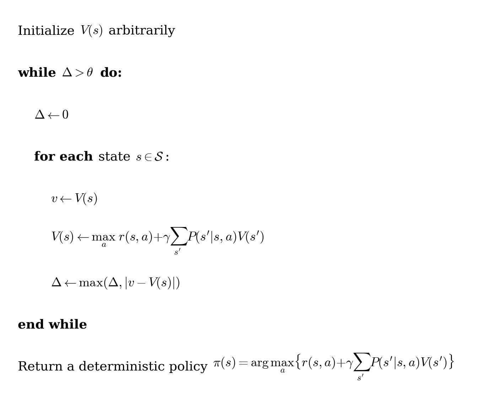
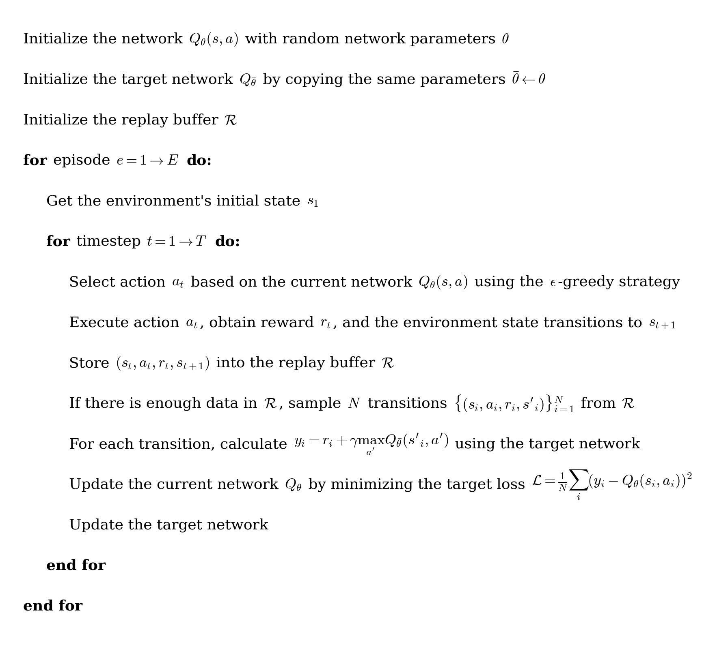

# 과제 4: 강화 학습

### 설치 (Installation)

모든 실습에 하나의 깨끗한 가상 환경(Virtual Environment)을 사용하십시오. 본 설정은 Linux 배포판 및 Windows의 Python 3.12 환경에서 테스트되었습니다. macOS에서 MuJoCo 렌더링 문제가 발생한다면 Linux, WSL, Docker 같은 대체 환경을 사용하는 것도 방법입니다.

### 1) 가상 환경 생성 및 활성화

저장소 루트(Repository Root)에서 다음을 실행합니다:

**Linux / macOS**
```bash
cd hw4_reinforcement_learning
python3.12 -m venv .venv
source .venv/bin/activate
```

**Windows (PowerShell)**
```powershell
cd hw4_reinforcement_learning
python -m venv .venv
.\.venv\Scripts\Activate.ps1
```

### 2) 의존성 패키지 설치

```bash
pip install -r requirements.txt
```

### 3) 스모크 테스트(Smoke Test) 실행
**스모크 테스트 A (ex1/ex2 스택: GridWorld + CartPole)**
```bash
python -c "from envs.grid_world import CliffWalkingEnv; from envs.cartpole_wrapper import CartPoleWrapper; g=CliffWalkingEnv(); c=CartPoleWrapper(seed=0); s=c.reset(); ns,r,d,i=c.step(c.sample_action()); c.close(); print('OK ex1/ex2:', g.n_states, s.shape, type(r).__name__)"
```

**스모크 테스트 B (ex3/ex4 스택: MuJoCo + SO100)**
```bash
python -c "from pathlib import Path; import numpy as np; from envs.so100_rl_env import SO100RLEnv; env=SO100RLEnv(xml_path=Path('assets/mujoco/so100_pos_ctrl.xml').resolve(), render_mode=None); obs,_=env.reset(seed=0); obs2,reward,term,trunc,info=env.step(np.zeros(env.action_dim, dtype=np.float32)); env.close(); print('OK ex3/ex4:', obs.shape, float(reward))"
```

두 명령어가 모두 `OK ...`를 출력하면 설치가 정상적으로 완료된 것입니다.

### 일반 지침 (General Guidelines)

- 제공된 코드의 **TODO** 부분을 완성하십시오.
- 명시적으로 언급되지 않은 한 **함수 시그니처(Function Signature)를 수정하지 마십시오**.
- `scripts/` 폴더에 있는 스크립트를 사용하여 구현한 알고리즘을 학습하고 테스트하십시오.
- 결과물(그래프, 로그)은 `logs/` 디렉토리에 저장됩니다.

코드를 깔끔하고 가독성 있게 유지하십시오. 다음 실습으로 넘어가기 전에 모든 코드가 정상적으로 실행되는지 확인하십시오.

### 학습 기록 가이드

각 실습을 마친 뒤 구현한 알고리즘의 핵심 아이디어, 실험 결과, 잘 되지 않았던 부분을 짧게 기록해 두세요. 강화학습 실험은 하이퍼파라미터와 랜덤 시드의 영향을 크게 받으므로, 실행 조건을 함께 적어 두면 좋습니다.

## 실습 1: GridWorld에서의 동적 계획법 (Dynamic Programming in GridWorld)

본 실습에서는 **Cliff Walking** 환경을 사용하여 테이블형(Tabular) MDP에서 **정책 반복(Policy Iteration)** 및 **가치 반복(Value Iteration)**을 구현합니다.

### Cliff Walking 환경
Cliff Walking 환경은 에이전트가 왼쪽 아래 모서리에서 출발하여 벼랑을 피해 오른쪽 아래 모서리의 목표 지점에 도달해야 하는 2D 그리드월드(Gridworld)입니다. 이 환경은 **확률적(Stochastic)**입니다. 에이전트가 행동(상, 하, 좌, 우)을 선택하면 `1 - slip_chance` 확률로 의도한 대로 실행되고, `slip_chance` 확률로 다른 행동 중 하나가 무작위로 균등하게 실행됩니다(즉, 에이전트가 "미끄러질" 수 있습니다). 그리드 경계를 벗어나는 움직임은 에이전트를 동일한 상태에 머무르게 합니다. 각 단계마다 -1의 보상(Reward)이 주어지며, 벼랑으로 떨어지면 -100의 보상을 받고 에피소드가 종료됩니다. 목표 지점에 도달해도 에피소드가 종료됩니다.

<p align="center">
  
</p>
<p align="center">
  <em>그림 1-1: Cliff Walking 환경 (AI 생성 이미지)</em>
</p>

### 알고리즘

본 실습에서는 두 가지 고전적인 동적 계획법 알고리즘인 **정책 반복**과 **가치 반복**을 구현합니다.

두 알고리즘의 의사코드(Pseudocode)는 아래와 같습니다.

<p align="center">
  
</p>
<p align="center">
  <em>그림 1-2: 정책 반복</em>
</p>

<p align="center">
  
</p>
<p align="center">
  <em>그림 1-3: 가치 반복</em>
</p>

두 방법 모두 최적 정책(Optimal Policy)으로 수렴해야 합니다.

## TODO 항목
### 코드 구현
`exercises/ex1_mdp.py` 파일의 TODO 부분을 채우십시오:

1. **정책 반복:** **정책 평가(Policy Evaluation)**, **정책 개선(Policy Improvement)** 및 **정책 반복 루프**를 구현하십시오.
2. **가치 반복:** **가치 반복 업데이트** 및 **탐욕적 정책 추출(Greedy Policy Extraction)**을 구현하십시오.

GridWorld 환경의 자세한 구현 및 설명은 `envs/grid_world.py`를 참조하십시오.
TODO를 구현한 후, 다음 명령어를 실행하여 알고리즘의 결과를 테스트할 수 있습니다:

```bash
python scripts/run_policy_iteration.py
```

```bash
python scripts/run_value_iteration.py
```

결과는 `logs/mdp/`에 저장됩니다.

**상태 가치(State Value)** 시각화와 **최적 정책** 시각화를 확인할 수 있어야 합니다.

### 확률성의 영향 (Effects of Stochasticity)
이 환경에서는 미끄러짐으로 인해 행동이 항상 의도한 대로 실행되지 않을 수 있습니다. 그 영향을 연구하기 위해 `--slip_chance` 인자를 설정하여 다양한 `slip_chance` 값으로 실험을 실행해 보십시오.

### 이론 질문
1. 정책 반복과 가치 반복의 업데이트 절차 측면에서의 차이점은 무엇인가요?
2. 할인 인자(Discount Factor) `gamma`가 0 또는 1에 가까워지면 어떤 일이 발생하나요?
3. 미끄러질 확률(`slip_chance`)을 높이면 최적 정책에 어떤 영향을 미치나요?
   - `slip_chance = 0.0`, `0.01`, `0.2`인 경우를 비교하십시오.
   - 확률성(Stochasticity)이 증가할 때 에이전트가 더 보수적으로 행동하는 경향이 있는 이유는 무엇인가요?

### 자기 점검
1. **코드:** `exercises/ex1_mdp.py`에서 TODO를 채워 완성한 코드.
2. **이론 질문:** 위 질문에 짧게 답해 봅니다.
3. **이미지:** `slip_chance`를 `0`, `0.01`, `0.2`로 설정하고 `scripts/run_policy_iteration.py` 및 `scripts/run_value_iteration.py`를 실행하여 얻은 상태 가치 함수 및 최적 정책의 시각화 자료.


## 실습 2: CartPole에서의 심층 Q 네트워크 (Deep Q-Network (DQN) on CartPole)

본 실습에서는 **연속적인 상태 공간(Continuous State Space)**을 가진 제어 문제를 해결하기 위해 **심층 Q 네트워크(Deep Q-Network, DQN)**를 구현합니다.

### 왜 DQN인가?

이전 실습에서는 각 상태-행동 쌍의 가치를 테이블에 저장하는 테이블형 강화학습(Tabular RL)을 사용했습니다. 그러나 상태 공간이 크거나 연속적인 경우에는 이 방식이 불가능해집니다.

이를 해결하기 위해 우리는 **함수 근사(Function Approximation)**를 사용하여 Q-가치를 추정합니다. DQN은 테이블을 신경망으로 대체하여 **이산적인 행동(Discrete Action)을 가진 연속적인 상태 공간**을 다룰 수 있게 해줍니다.

### CartPole 환경

CartPole 환경은 카트가 트랙을 따라 움직이고 그 위에 폴(막대기)이 연결되어 있는 고전적인 제어 문제입니다. 목표는 카트에 힘을 가해 폴이 쓰러지지 않고 수직을 유지하도록 하는 것입니다.

<p align="center">
  
</p>
<p align="center">
  <em>그림 2-1: CartPole 환경</em>
</p>

각 타임스텝(Timestep)마다 에이전트는 **4차원 연속 상태**를 수신하고 **이산 행동**을 선택합니다.

#### 상태 공간 (State Space)

| 인덱스 | 설명 | 범위 |
| ----- | --------------------- | ---------------- |
| 0     | 카트 위치 (Cart position) | [-2.4, 2.4]      |
| 1     | 카트 속도 (Cart velocity) | (-inf, inf)      |
| 2     | 폴 각도 (Pole angle) | ~[-41.8°, 41.8°] |
| 3     | 폴 각속도 (Pole angular velocity) | (-inf, inf)      |

#### 행동 공간 (Action Space)

| 행동 | 설명 |
| ------ | ------------------ |
| 0      | 카트를 왼쪽으로 밀기 |
| 1      | 카트를 오른쪽으로 밀기 |

에이전트는 **매 타임스텝마다 +1의 보상**을 받습니다. 에피소드는 다음과 같은 경우에 종료됩니다:
- 폴이 임계 각도 이상으로 쓰러질 때,
- 카트가 중심에서 너무 멀리 벗어날 때,
- 또는 최대 에피소드 길이에 도달했을 때.

### DQN 알고리즘

DQN은 신경망을 사용하여 Q-함수를 근사함으로써 Q-러닝(Q-learning)을 확장합니다.

DQN의 핵심 구성 요소는 다음과 같습니다:

- **Q-러닝 업데이트:** 벨만 방정식(Bellman Equation)으로부터 학습  
- **경험 재현(Experience Replay):** 상관관계를 깨기 위해 무작위 미니배치(Mini-batch)를 샘플링  
- **타깃 네트워크(Target Network):** 느리게 업데이트되는 네트워크를 사용하여 학습을 안정화  

자세한 내용은 원본 논문을 참조하십시오: https://arxiv.org/abs/1312.5602. 아래에 의사코드를 제공합니다.

<p align="center">
  
</p>
<p align="center">
  <em>그림 2-2: 심층 Q 네트워크 (DQN)</em>
</p>

## TODO 항목

### 코드 구현 및 하이퍼파라미터 튜닝 (Hyperparameter Tuning)

`exercises/ex2_dqn.py` 및 `exercises/ex2_dqn_config.py` 파일의 TODO 부분을 채우십시오:

1. **DQN 구현:** 재현 버퍼(Replay Buffer)에 전이(Transition) 저장, Q-네트워크 순전파(Forward Pass) 구현, 엡실론-탐욕(Epsilon-greedy) 정책을 사용한 행동 선택, 학습을 위한 TD 타깃(TD Target) 계산을 포함한 DQN의 핵심 구성 요소를 완성하십시오.
2. **하이퍼파라미터 튜닝:** 성능을 향상시키기 위해 `exercises/ex2_dqn_config.py`에서 핵심 하이퍼파라미터(`lr`, `epsilon`, `target_update`, `hidden_dim`)를 튜닝하십시오. 

### 학습 (Training)

TODO를 구현한 후, 다음 명령어를 사용하여 에이전트를 학습시킬 수 있습니다:

```bash
python scripts/train_dqn.py
```

학습 결과(모델 및 학습 곡선)는 다음에 저장됩니다:

```bash
python logs/dqn
```

### 평가 (Evaluation)

학습된 모델을 평가하려면 다음을 실행하십시오:

```bash
python scripts/eval_dqn.py
```

GUI 창에서 학습된 정책을 시각적으로 확인할 수도 있습니다:

```bash
python scripts/eval_dqn.py --play
```

이 명령어를 실행하면 에이전트의 행동을 직접 관찰할 수 있는 대화형 창이 열립니다.

### 이론 질문
1. DQN에서 경험 재현(Experience Replay)이 중요한 이유는 무엇인가요?
2. DQN에서 타깃 네트워크의 역할은 무엇인가요? 어떻게 안정성을 향상시키나요?
3. Double DQN이란 무엇이며, 표준 DQN과 비교하여 어떻게 과대평가 편향(Overestimation Bias)을 줄이나요? (참조: [Deep Reinforcement Learning with Double Q-learning](https://arxiv.org/abs/1509.06461))

### 자기 점검
1. **코드:** `exercises/ex2_dqn.py` 및 `exercises/ex2_dqn_config.py`에서 TODO를 완료한 구현 코드.
2. **결과:** 제공된 스크립트를 실행하여 생성된 학습 곡선(Training Curve) 및 출력된 평가 요약본을 확인합니다.
3. **이론 질문:** 위 질문에 짧게 답해 봅니다.

## 실습 3: SO100에서의 근접 정책 최적화 (Proximal Policy Optimization (PPO) on SO100)

본 실습에서는 SO100 로봇을 이용한 연속 제어 말단 장치(End-effector) 추적 작업을 위해 PPO를 구현합니다. 실습 2에서 소개된 SO100 MuJoCo 환경을 이제 강화학습 관점에서 다시 다룹니다.

### 소개 (Introduction)

실습 1과 2는 저차원 토이 도메인(테이블형 그리드월드 및 CartPole)에 초점을 맞추었으며, 이는 핵심 강화학습 아이디어를 배우기에는 좋지만 실제 로봇 제어와는 거리가 멉니다. 실습 3과 4에서는 정책이 (관절 공간에서) 연속적인 행동을 출력하고 더 풍부한 동역학을 처리해야 하는 MuJoCo 기반 SO100 추적 작업으로 이동합니다.

구조는 PPO(온정책(On-policy))와 SAC(오프정책(Off-policy)) 간에 의도적으로 공유되도록 설계되었습니다. 동일한 환경, 보상 구조 및 평가 프로토콜 하에서 두 가지 주요 강화학습 패러다임을 비교하게 됩니다. 목표는 각 알고리즘을 구현하는 것뿐만 아니라, 연속 제어에서의 안정성-샘플 효율성 트레이드오프(Stability-sample-efficiency tradeoff)를 이해하는 것입니다.

구현을 시작하기 전에 이 주제에 관한 두 편의 선정된 논문을 읽어보는 것을 권장합니다. 제안된 구현은 논문과 약간의 차이가 있을 수 있습니다. 우리가 자체 솔루션에서 사용한 구현의 의사코드는 아래에서 찾을 수 있습니다.

### 상태 공간 (State Space)

관측값(Observation)은 로봇 베이스 프레임(Base Frame)에서 구성된 19차원 벡터입니다:

| 인덱스 | 차원 | 설명 |
| ----- | --------- | -------------------------------------------- |
| 0–5   | 6         | 관절 위치 (`qpos`) |
| 6–8   | 3         | 말단 장치 위치 (베이스 프레임) |
| 9–12  | 4         | 말단 장치 방향 쿼터니언 (베이스 프레임) |
| 13–15 | 3         | 목표 위치 (베이스 프레임) |
| 16–18 | 3         | 위치 오차: 목표 − 말단 장치 (베이스 프레임) |

### 행동 공간 (Action Space)

정책은 \([-1, 1]^6\) 범위의 **6차원 연속 행동**을 출력합니다. 각 성분은 `process_action`을 통해 해당하는 관절의 물리적 위치 범위로 선형 매핑됩니다.

### 관절 공간 (Joint Space)

SO100 로봇 팔은 6개의 회전 관절(Revolute Joint, 위치 제어 방식)을 가집니다:

| 인덱스 | 관절 이름 | 축 | 범위 (rad) |
| ----- | ------------ | ----- | ------------------- |
| 0     | Rotation     | Y     | [−1.92, 1.92]       |
| 1     | Pitch        | X     | [−3.32, 0.174]      |
| 2     | Elbow        | X     | [−0.174, 3.14]      |
| 3     | Wrist_Pitch  | X     | [−1.66, 1.66]       |
| 4     | Wrist_Roll   | Y     | [−2.79, 2.79]       |
| 5     | Jaw          | Z     | [−0.174, 1.75]      |

### 추천 읽기 자료 (Suggested Reading)

- PPO 논문: https://arxiv.org/abs/1707.06347
- 일반화된 이득 추정(Generalized Advantage Estimation, PPO에서 사용됨): https://arxiv.org/abs/1506.02438

<!-- ### Implementation Pseudocode (This Homework)

<p align="center">
  
</p>
<p align="center">
  <em>Figure 3-1: PPO (Actor-Critic, this homework)</em>
</p> -->

## TODO 항목

### 코드 구현

`exercises/ex3_ppo.py` 파일의 TODO 부분을 채우십시오:

1. **행동/가치/로그 확률 계산:** `select_action`에서 정책 행동 샘플링, 행동 클리핑(Clipping), 로그 확률 추출, 행동 평균 및 표준편차 추출을 구현하십시오.
2. **KL 발산(KL Divergence):** `compute_kl_mean`에서 이전 가우시안 정책 분포와 새로운 가우시안 정책 분포 사이의 KL 발산을 계산하십시오.
3. **대리 손실(Surrogate Loss):** `compute_surrogate_loss`에서 PPO 대리 손실 항을 구현하십시오.
4. **가치 손실(Value Loss):** `compute_value_loss`에서 PPO 가치 손실을 구현하십시오.
5. **엔트로피 손실(Entropy Loss):** `compute_entropy_loss`에서 PPO 엔트로피 손실을 구현하십시오.
6. **최적화 단계:** `update`에서 액터(Actor) 및 크리틱(Critic) 업데이트 루프의 한 단계를 완성하십시오.

### 학습 (Training)

TODO를 구현한 후, 다음 명령어를 사용하여 에이전트를 학습시킬 수 있습니다:

```bash
python scripts/train_ppo.py
```

학습 결과물은 다음에 저장됩니다:

- `logs/ppo/YY_MM_DD_HH_MM_SS_model` (체크포인트 및 텐서보드(Tensorboard) 이벤트 로그)

학습 곡선은 텐서보드에 저장됩니다. 이를 확인하려면 다음 명령어를 실행하십시오:

```bash
tensorboard --logdir="your tensorboard event file path"
```

### 평가 (Evaluation)

학습된 모델을 평가하려면 다음을 실행하십시오:

```bash
python scripts/eval_ppo.py
```

GUI 창에서 정책 플레이백(Playback)을 실행하려면 다음을 실행하십시오:

```bash
python scripts/eval_ppo.py --play
```

macOS에서 MuJoCo/OpenGL 렌더링 문제가 발생하는 경우, 다음 명령어로 평가를 실행하십시오:

```bash
.venv/bin/mjpython scripts/eval_ppo.py --play
```

평가 요약본이 터미널 화면에 출력됩니다. 예시는 다음과 같습니다:

```
===== Evaluation Summary =====
Number of episodes   : 20
Mean return          : 60.058
Std return           : 12.936
Min return           : 21.256
Max return           : 69.988
Median return        : 65.168
Mean length          : 30.00
Std length           : 0.00
Mean tracking error  : 0.015097
Std tracking error   : 0.015067
Min tracking error   : 0.003123
Max tracking error   : 0.064921
```


### 이론 질문
1. PPO는 TRPO처럼 KL 발산을 직접 제약하는 대신 왜 확률 비율(Probability Ratio)을 클리핑하나요? 클리핑을 완전히 제거하면 어떤 문제가 발생하나요?
2. PPO는 매 업데이트 후 수집된 모든 데이터를 버립니다. 더 많은 경사 하강법(Gradient Step) 단계를 위해 이전 롤아웃(Rollout) 데이터를 단순히 재사용할 수 없는 이유는 무엇인가요?
3. GAE 파라미터 \(\lambda\)는 무엇을 제어하나요? 극단적인 경우인 \(\lambda = 0\)과 \(\lambda = 1\)일 때 어떤 일이 발생하나요?

### 자기 점검
1. **코드:** `exercises/ex3_ppo.py`에서 TODO를 완료한 구현 코드.
2. **결과:** 텐서보드의 학습 곡선과 제공된 스크립트를 실행하여 생성된 평가 요약본을 확인합니다.
3. **이론 질문:** 위 질문에 짧게 답해 봅니다.


## 실습 4: SO100에서의 소프트 액터-크리틱 (Soft Actor-Critic (SAC) on SO100)

본 실습에서는 동일한 연속 제어 SO100 추적 작업을 위해 SAC를 구현합니다.
실습 3과 마찬가지로, 실습 2의 SO100 MuJoCo 환경을 다시 다룹니다.

### 추천 읽기 자료 (Suggested Reading)

- SAC 논문: https://arxiv.org/abs/1812.05905

<!-- ### Implementation Pseudocode (This Homework)

<p align="center">
  
</p>
<p align="center">
  <em>Figure 4-1: SAC (this homework)</em>
</p> -->

### SAC 논문 대비 조정 사항

우리의 구현은 핵심 SAC 알고리즘(Haarnoja et al., 2018)을 따르지만 두 가지 기능을 추가합니다.

1. **자동 온도 튜닝(Automatic Temperature Tuning)**이 기본적으로 포함되어 있습니다.

2. 우리의 구현은 학습이 시작되기 전에 다양한 초기 데이터로 재현 버퍼를 채우기 위해 첫 `start_steps = 1000` 환경 단계 동안 **균등 무작위 행동(Uniform Random Action)**을 사용합니다.

## TODO 항목

### 코드 구현

`exercises/ex4_sac.py` 파일의 TODO 부분을 채우십시오:

1. **정책 행동 샘플링:** `select_action`에서 행동 샘플링을 구현하십시오.
2. **크리틱 손실(Critic Loss):** `compute_critic_loss`에서 SAC 벨만 타깃 및 크리틱 손실을 구현하십시오.
3. **액터 손실(Actor Loss):** `compute_actor_loss`에서 액터 목적 함수를 구현하십시오.
4. **엔트로피 손실(Entropy Loss):** `compute_actor_loss`에서 알파(\(\alpha\)) 손실을 구현하십시오.
5. **타깃 업데이트:** `soft_update_targets`에서 소프트 타깃 네트워크 업데이트(Soft Target-network Update)를 구현하십시오.
6. **최적화 단계:** `update`에서 액터, 크리틱 및 알파 업데이트 루프의 한 단계를 완성하십시오.

### 학습 (Training)

TODO를 구현한 후, 다음 명령어를 사용하여 에이전트를 학습시킬 수 있습니다:

```bash
python scripts/train_sac.py
```

학습 결과물은 다음에 저장됩니다:

- `logs/sac/YY_MM_DD_HH_MM_SS_model` (체크포인트 및 텐서보드 이벤트 로그)

학습 곡선은 텐서보드에 저장됩니다. 이를 확인하려면 다음 명령어를 실행하십시오:

```bash
tensorboard --logdir="your tensorboard event file path"
```

### 평가 (Evaluation)

학습된 모델을 평가하려면 다음을 실행하십시오:

```bash
python scripts/eval_sac.py
```

GUI 창에서 정책 플레이백을 실행하려면 다음을 실행하십시오:

```bash
python scripts/eval_sac.py --play
```

실습 3과 마찬가지로 평가 요약본이 터미널 화면에 출력됩니다.

### 이론 질문
1. SAC는 보상에 엔트로피 보너스(Entropy Bonus)를 추가합니다. 이것의 장점은 무엇인가요?
2. SAC는 tanh를 통해 행동을 스쿼싱(Squashing)합니다. 이로 인해 로그 확률 보정(Log-probability Correction)이 필요한 이유는 무엇인가요?
3. 온도 파라미터 \(\alpha\)는 자동으로 튜닝됩니다. 정책의 엔트로피가 타깃 엔트로피보다 높거나 낮을 때 어떤 일이 발생하나요?
4. 데이터 대비 업데이트(Update-to-data, UTD) 비율 측면에서 SAC는 PPO와 어떻게 비교되나요? (UTD = 경사 하강 업데이트 단계 수 / 환경 단계 수)
5. 온정책(On-policy) 알고리즘과 오프정책(Off-policy) 알고리즘의 장단점에 대해 간략히 논의하십시오.


### 자기 점검
1. **코드:** `exercises/ex4_sac.py`에서 TODO를 완료한 구현 코드.
2. **결과:** 텐서보드의 학습 곡선과 제공된 스크립트를 실행하여 생성된 평가 요약본을 확인합니다.
3. **이론 질문:** 위 질문에 짧게 답해 봅니다.

## 전체 실습 체크리스트

- `exercises/ex1_mdp.py`
- `exercises/ex2_dqn.py`
- `exercises/ex2_dqn_config.py`
- `exercises/ex3_ppo.py`
- `exercises/ex4_sac.py`

위 파일들의 TODO를 완성하고, 각 실습의 실행 스크립트가 오류 없이 동작하는지 확인하세요. 파일 이름이나 함수 시그니처를 바꾸면 제공된 스크립트와 노트북이 깨질 수 있으므로 유지하는 것이 좋습니다.
